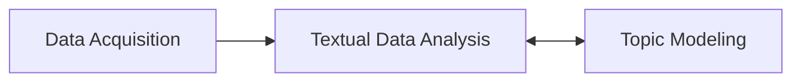

# nlp_project

## Proposal
The goal of this project was to analyze Consumer Financial Protection Bureau Customer complaints and identify topics and commalities of those complaints

## Data
* data was collected from [Consumer Financial Protection Bureau website](https://www.consumerfinance.gov/data-research/consumer-complaints/search/?date_received_max=2022-03-15&date_received_min=2011-12-01&page=1&searchField=all&size=25&sort=created_date_desc&tab=List)

## Workflow

* collect data from CFPB website
* analyze textual data using NLTK, Genesis, SpaCy
* identify topics

## Deliverables
* presentation sides
